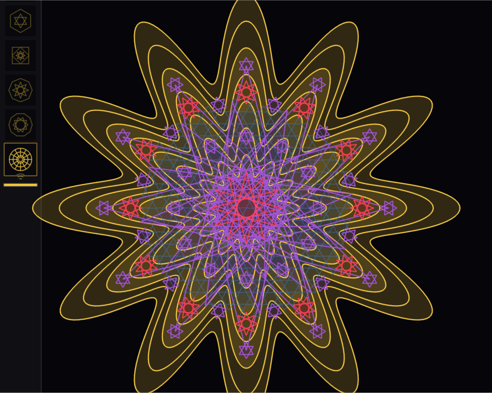

# Ornament of Pressure

Real-time Islamic geometric ornament visualizer with audio reactivity.

A native Windows C++ application that renders intricate Islamic geometric patterns using Hankin/PIC construction, star polygons, and multi-grid overlays — all reacting to live microphone input.



## Features

- **6 distinct ornament presets** — 12-fold Mandala, Hexagonal, Square Kufic, Octagonal, Decagonal, Muqarnas
- **Audio-reactive** — FFT analysis of microphone input drives pattern scale, rotation, and brightness
- **7 color layers** — gold, warm white, teal, blue, purple, crimson, magenta with per-layer audio mapping
- **Filled regions** — half of all closed contours are filled with semi-transparent color using stencil even-odd rule
- **Smooth transitions** — cross-fade morph when switching between ornaments
- **Adjustable sensitivity** — scroll wheel or arrow keys control audio reactivity gain
- **Closed contours only** — all geometry consists of proper closed loops (no dangling lines)
- **SVG export** — available in the web version (`index.html`)

## Controls

| Input | Action |
|-------|--------|
| Click thumbnail / Keys 1-6 | Switch ornament |
| Scroll wheel / Up-Down arrows | Adjust audio sensitivity |
| Escape | Quit |

## Building

Requires MSYS2 with ucrt64 toolchain:

```bash
pacman -S mingw-w64-ucrt-x86_64-gcc mingw-w64-ucrt-x86_64-SDL2 mingw-w64-ucrt-x86_64-glew

export PATH="/c/msys64/ucrt64/bin:$PATH"
g++ -O2 -std=c++17 main.cpp -o ornament.exe -lmingw32 -lSDL2main -lSDL2 -lglew32 -lopengl32
```

Make sure `SDL2.dll` and `glew32.dll` are in the same directory as the executable.

## Architecture

Single-file C++ (`main.cpp`, ~1250 lines):

- **Geometry** — Hankin construction on square, triangular, and hexagonal grids; star polygons {n/k}; polar star boundaries
- **Audio** — SDL2 audio capture, 1024-sample Cooley-Tukey FFT with Hann windowing, 3-band analysis (bass/mids/highs)
- **Rendering** — OpenGL 2.1 fixed-function pipeline, VBO + glMultiDrawArrays, stencil-based polygon fills
- **Chain building** — spatial hash graph, degree-1 pruning, straightest-path closed loop tracing

## Web Version

`index.html` contains an earlier web-based version with basic Hankin construction on a triangle grid. Open directly in a browser.
